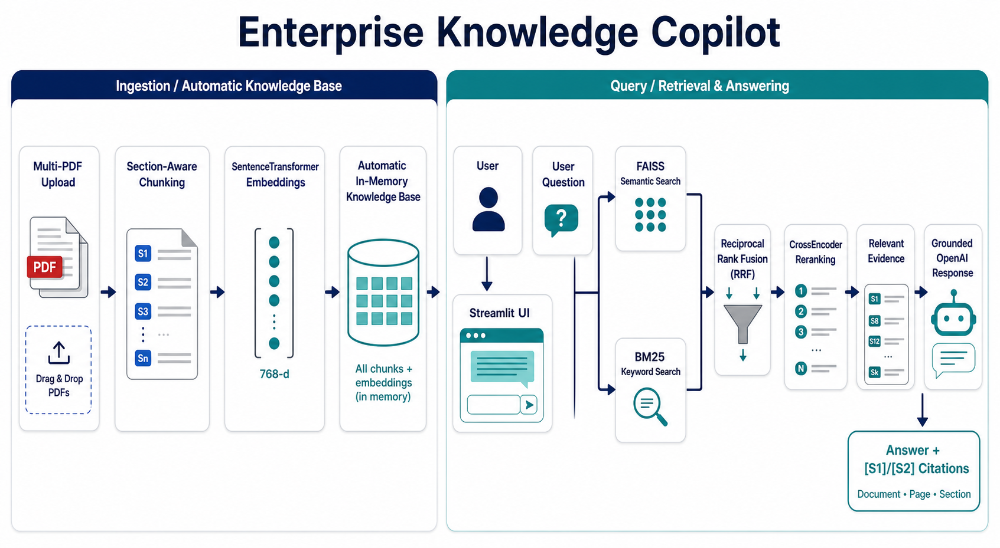
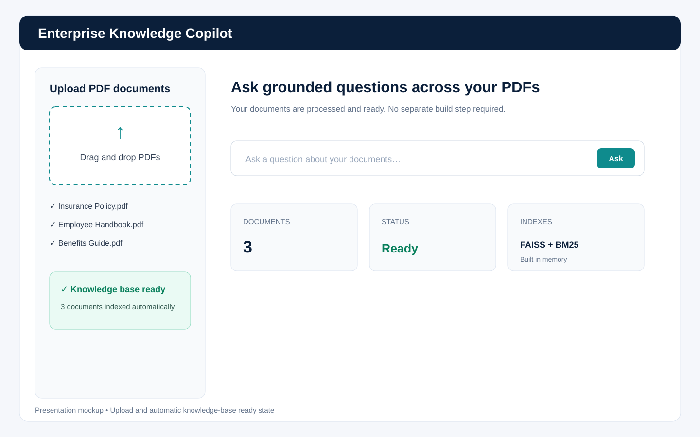
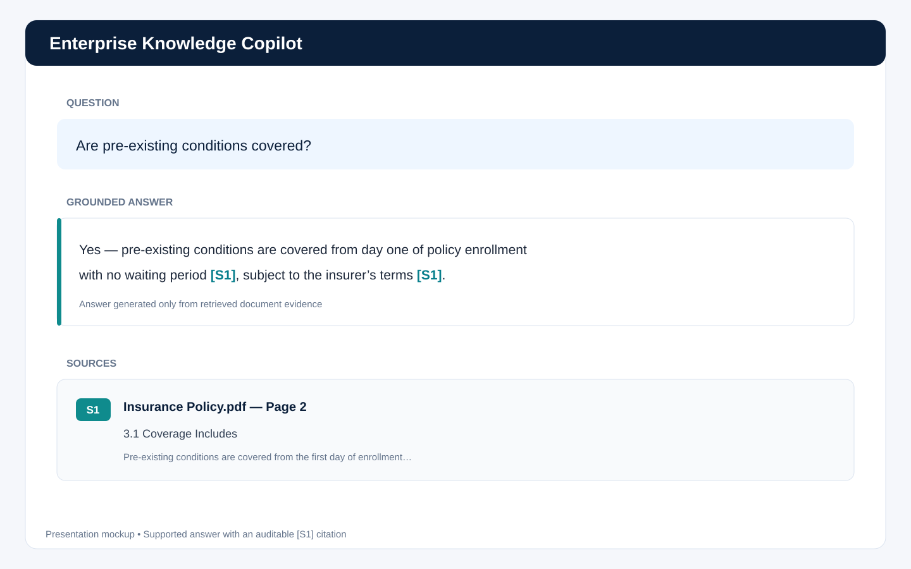
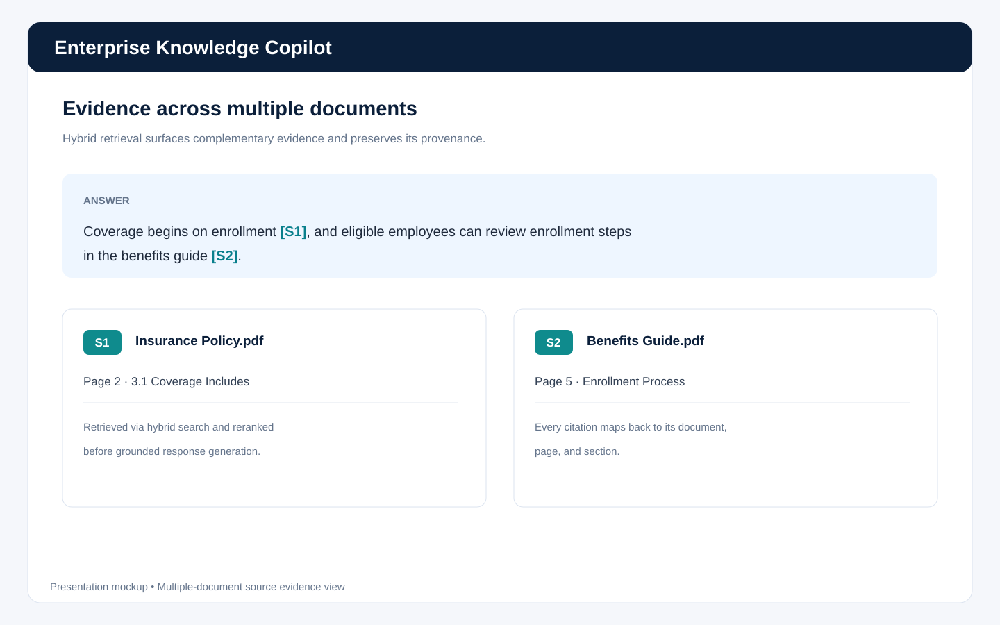
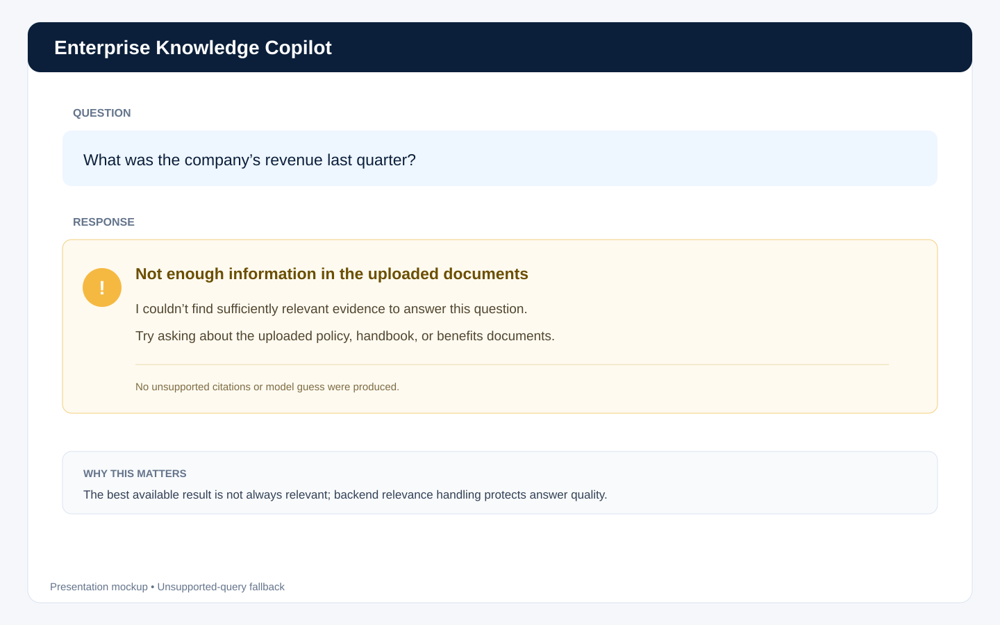

# Enterprise Knowledge Copilot

> Advanced multi-document RAG for grounded answers across uploaded PDFs.

[](https://www.python.org/)
[](https://streamlit.io/)
[](#advanced-rag-pipeline)
[](#deployment)

**Live demo:** [enterpriseknowledge-shiva.streamlit.app](https://enterpriseknowledge-shiva.streamlit.app/)  
**GitHub:** [github.com/shiva-prasad16/enterprise_knowledge](https://github.com/shiva-prasad16/enterprise_knowledge)



## Problem

Finding a precise answer across several long PDFs is slow, and a general-purpose LLM can answer from its own knowledge instead of the supplied documents. Basic vector-only RAG can also miss exact terminology, return weak evidence, or produce an answer even when the knowledge base does not support the question.

## Solution

Enterprise Knowledge Copilot is a Streamlit application that turns uploaded PDFs into an automatic, in-memory knowledge base. It combines semantic and keyword retrieval, fuses both rankings, reranks the candidates, and sends only relevant evidence to OpenAI for grounded response generation. Answers contain inline `[S1]`/`[S2]` references linked to document, page, and section metadata.

## Highlights

- Multi-PDF upload with automatic knowledge-base creation
- Section-aware chunks that retain document, page, and section metadata
- SentenceTransformer embeddings and FAISS semantic retrieval
- BM25 keyword retrieval for exact terms and lexical matches
- Reciprocal Rank Fusion (RRF) across both result lists
- CrossEncoder reranking before context reaches the LLM
- Backend relevance handling, kept out of the user-facing interface
- Grounded OpenAI answers with `[S1]`/`[S2]` citations
- Explicit fallback when the uploaded documents do not contain enough evidence
- Streamlit deployment with a clean, portfolio-ready interface

## Architecture

The system has two connected flows:

1. **Ingestion:** upload PDFs → extract text and metadata → section-aware chunking → embeddings → automatic in-memory knowledge base.
2. **Question answering:** run FAISS and BM25 in parallel → combine rankings with RRF → rerank with a CrossEncoder → apply backend relevance handling → generate a grounded response → render answer and sources.

The knowledge base is rebuilt automatically when PDFs are uploaded; users do not need a separate “Build” action.

## Advanced RAG pipeline

### 1. Section-aware ingestion

PDF text is divided into usable passages while preserving provenance. Each chunk carries the source document, page number, and detected section so evidence can be traced later. Where used, `RecursiveCharacterTextSplitter` is limited to text splitting; this project does not claim LangChain orchestration.

### 2. Automatic in-memory knowledge base

After upload, the app creates the retrieval structures in memory: chunks and metadata, dense embeddings for semantic search, a FAISS index, and a BM25 corpus/index. This provides a simple session-oriented workflow without claiming persistent storage.

### 3. Parallel hybrid retrieval

- **FAISS semantic search** retrieves passages that are conceptually close to the question.
- **BM25 keyword search** retrieves passages with strong lexical overlap and exact domain terms.

Running both helps cover weaknesses in either retrieval method alone.

### 4. Reciprocal Rank Fusion

RRF merges the FAISS and BM25 rankings using rank positions rather than incomparable raw scores. Documents that rank well in either or both lists move into a single candidate set.

### 5. CrossEncoder reranking

A CrossEncoder scores question–passage pairs jointly and reorders the fused candidates. The highest-ranked evidence is selected for answer generation. Technical relevance controls remain backend concerns rather than end-user tuning controls.

### 6. Grounded generation and citations

The selected passages are supplied as evidence to OpenAI. The response is instructed to answer from that evidence and cite statements inline as `[S1]`, `[S2]`, and so on. The source panel maps each label to:

```text
[S1] Insurance Policy.pdf — Page 2
3.1 Coverage Includes
```

### 7. Unsupported-query handling

If the retrieval layer does not find sufficiently relevant evidence, the application returns a clear “not enough information in the uploaded documents” response instead of inviting the model to guess. This is essential because a top-ranked passage is not automatically a relevant passage.

## Screenshots

| Automatic KB ready | Grounded answer |
|---|---|
|  |  |

| Multi-document evidence | Unsupported question |
|---|---|
|  |  |

> These are presentation mockups based on the verified app behavior because the live application was not available in this workspace. Replace them with live captures later if desired, keeping the same filenames to preserve README links.

## Tech stack

| Area | Technology |
|---|---|
| Application | Python, Streamlit |
| PDF pipeline | PDF text extraction, section-aware chunking |
| Embeddings | SentenceTransformers |
| Semantic retrieval | FAISS |
| Keyword retrieval | BM25 |
| Fusion | Reciprocal Rank Fusion (RRF) |
| Reranking | CrossEncoder |
| Generation | OpenAI API |
| Deployment | Streamlit Community Cloud / Streamlit hosting |

## Setup

Because the source repository was not attached to this presentation workspace, use the dependency file and entry point from the actual repository:

```bash
git clone https://github.com/shiva-prasad16/enterprise_knowledge.git
cd enterprise_knowledge
python -m venv .venv
```

Activate the environment, then install the project dependencies:

```bash
pip install -r requirements.txt
```

Run the Streamlit entry point from the repository (commonly `app.py`):

```bash
streamlit run app.py
```

Update the filename above if the actual entry point differs.

## Environment variables and security

Create a local `.env` file or use Streamlit secrets, depending on the implementation:

```env
OPENAI_API_KEY=your_api_key_here
```

- Never commit `.env`, `.streamlit/secrets.toml`, or API keys.
- Add secret files to `.gitignore`.
- Configure `OPENAI_API_KEY` in the deployment platform's secret manager.
- Treat uploaded PDFs as sensitive; avoid logging their text or user questions unnecessarily.
- For production use, add file-size/type validation, retention rules, access control, and abuse limits.

## Usage

1. Open the Streamlit app.
2. Upload one or more PDF documents.
3. Wait for the automatic “knowledge base ready” confirmation.
4. Ask a question whose answer should exist in the uploaded documents.
5. Review the grounded answer and the `[S1]`/`[S2]` source details.
6. Try an unrelated question to verify the unsupported-query fallback.

## Evaluation

The implemented evaluation approach covers both retrieval and answer behavior across supported and unsupported questions.

| Test | Expected result |
|---|---|
| Known answer in one PDF | Correct evidence is retrieved and the answer cites it |
| Evidence split across PDFs | Relevant sources from multiple documents can appear |
| Exact domain terminology | BM25 complements semantic retrieval |
| Paraphrased question | FAISS retrieves conceptually related passages |
| Unsupported question | The app declines due to insufficient document evidence |
| Citation audit | Each source label maps to the correct document, page, and section |

For repeatable evaluation, maintain a small gold set with question, expected source, expected page/section, and support status. Track retrieval hit rate or Recall@K, citation correctness, groundedness, and unsupported-query accuracy.

## Deployment

The project has been deployed with Streamlit. Add the exact public URL here:

**Live app:** [https://enterpriseknowledge-shiva.streamlit.app/](https://enterpriseknowledge-shiva.streamlit.app/)

Typical deployment checklist:

1. Push the application and dependency file to GitHub.
2. Connect the repository to Streamlit hosting.
3. Select the actual application entry point.
4. Add `OPENAI_API_KEY` through deployment secrets.
5. Deploy and test PDF upload, supported Q&A, citations, and rejection behavior.

## Repository structure

The source repository was not present while this README was prepared, so the exact filenames should be mapped to the real project rather than invented. A typical responsibility-based layout is:

```text
repository/
├── app.py    # UI and session flow
├── ingestion.py     # PDF parsing and section-aware chunks
├── retrieval.py         # FAISS, BM25, RRF, reranking, relevance
├── generation.py        # Grounded OpenAI prompt and citations
├── requirements.txt
├── README.md
├── assets/
│   └── architecture.png
└── screenshots/
    ├── 01-upload-kb-ready.svg
    ├── 02-supported-answer.svg
    ├── 03-multi-document-evidence.svg
    └── 04-unsupported-query.svg
```

Replace bracketed filenames with the actual repository names before publishing.

## Limitations

- The knowledge base is in memory and session-oriented rather than persistent.
- Answer quality depends on PDF extraction quality, chunk boundaries, and source content.
- Scanned PDFs may require OCR if they do not contain extractable text.
- Tables, diagrams, and complex multi-column layouts can lose structure during extraction.
- Retrieval and generation add latency and compute/API cost.
- A relevance policy reduces unsupported answers but cannot guarantee perfect factuality.
- The current presentation does not claim authentication, access control, or production document governance.

## Future improvements

- OCR and layout-aware parsing for scanned or complex PDFs
- Persistent, user-scoped indexes with document lifecycle controls
- Authentication and role-based access
- Automated RAG evaluation with a versioned gold dataset
- Retrieval telemetry and citation-quality dashboards
- Query rewriting or decomposition for complex questions
- Streaming answers, caching, and incremental index updates
- Stronger prompt-injection defenses for untrusted documents

## Presentation assets
- [Architecture diagram](assets/architecture.png)

